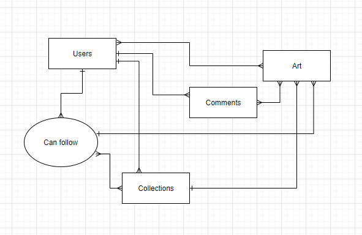

# DigitalArtHub
### Mid-term project for DeltaV   
Created and finished by:
- Nathan Hall 
    - [Github](https://github.com/Vavyo)
- Jean McMahon 
    - [Github](https://github.com/jmcia2020)
- Adara Townsends 
    - [Github](https://github.com/adard2002)
- Ben Hemann 
    - [Github](https://github.com/Kozer2)

# Links to different parts of code

### ERD diagram

# Tools Used

# How it works

# How to use it
