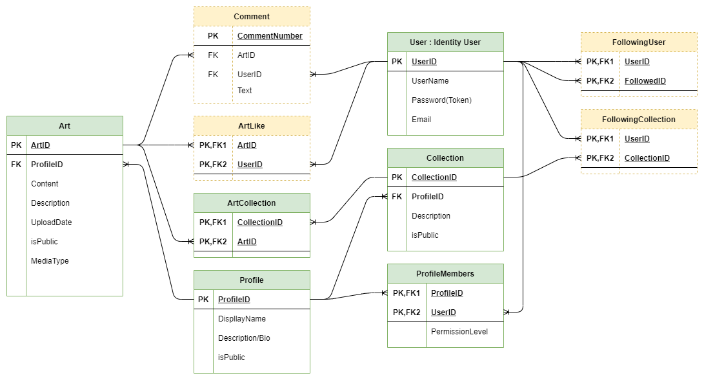

# DigitalArtHub
### Mid-term project for DeltaV   
Created and finished by:
- Nathan Hall 
    - [Github](https://github.com/Vavyo)
- Jean McMahon 
    - [Github](https://github.com/jmcia2020)
- Adara Townsends 
    - [Github](https://github.com/adard2002)
- Ben Hemann 
    - [Github](https://github.com/Kozer2)

# User stories
[UserStories](requirements.md)

# Links to different parts of code

### ERD diagram
This is our first rough example for our ERD.

When we sat down to discuss the database relationships we came up with this for our ERD.

# Dependencies Used
The dependencies we used are:
 - Microsoft.AspNetCore.Authentication.JwtBearer
 - Microsoft.AspNetCore.Identity.EntityFrameworkCore
 - Microsoft.AspNetCore.Mvc.NewtonsoftJson
 - Microsoft.EntityFrameworkCore.SqlServer
 - Microsoft.EntityFrameworkCore.Tools
 - Microsoft.VisualStudio.Web.CodeGeneration.Design
 - Swashbuckle.AspNetCore

# Tools Used

# How it works

# How to use it
