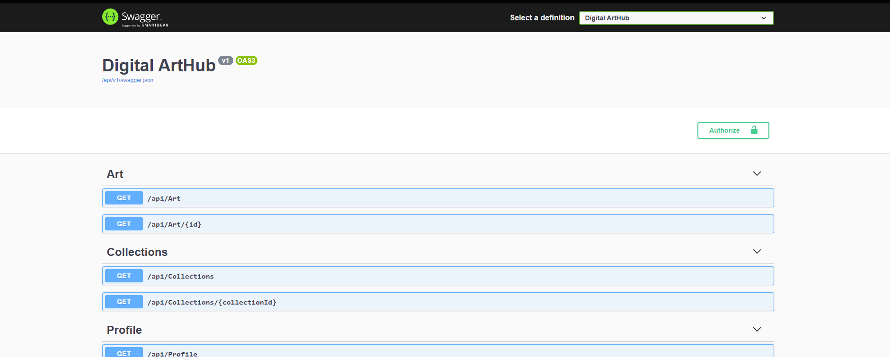
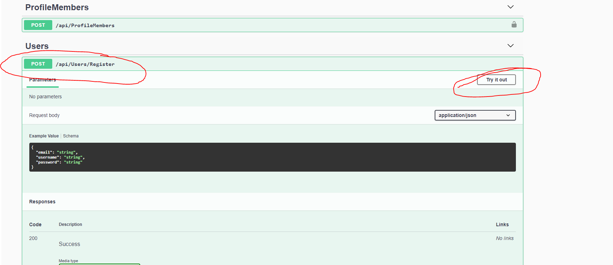
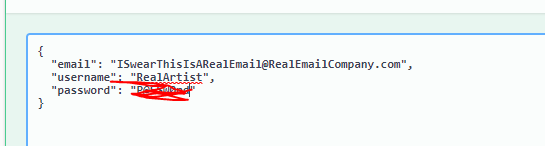
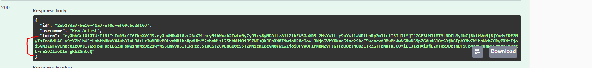
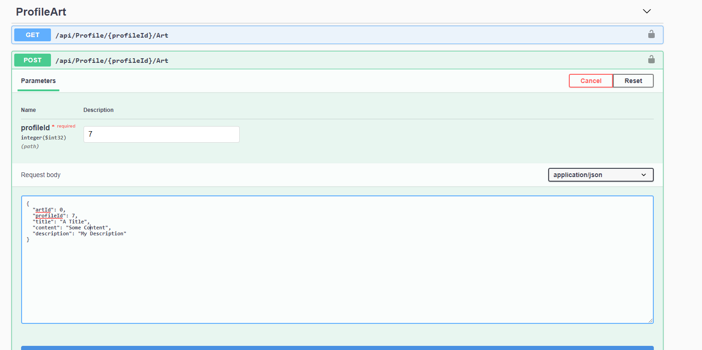

# DigitalArtHub
### Mid-term project for DeltaV   
Created and finished by:
- Nathan Hall 
    - [Github](https://github.com/Vavyo)
- Jean McMahon 
    - [Github](https://github.com/jmcia2020)
- Adara Townsend
    - [Github](https://github.com/adard2002)
- Ben Hemann 
    - [Github](https://github.com/Kozer2)

# Link to Deployed Website
[Digital Art Hub](https://digitalarthub.azurewebsites.net/index.html)

### ERD diagram
This is our first rough example for our ERD.

When we sat down to discuss the database relationships we came up with this for our ERD.

# Dependencies Used
The dependencies we used are:

- Swashbuckle.AspNetCore
- Microsoft.AspNetCore.Identity.EntityFrameworkCore
- Microsoft.AspNetCore.Mvc.NewtonsoftJson
- Microsoft.EntityFrameworkCore.SqlServer
- Microsoft.EntityFrameworkCore.Tools
- Microsoft.AspNetCore.Authentication.JwtBearer
- Microsoft.VisualStudio.Web.CodeGeneration.Design

# Tools Used
The tools we used for this project are:
- Github to host our code
- Azure to host our deployed website
- Swagger to show our API routes and documentation 

# How it works
Our project works by allowing a user to sign up for an account. When they create an account it ties a profile to their user information. 
They can then log in and from there they can create works of art. Each time they create a work of art they can specify its type, give it a title, and give it a description. Anyone, account or not, can view our user accounts or works of art. 

# How to use it
First they will come to our Swagger Homepage.

From there scroll down to Users and click on Register. Then click on Try it out!

Fill out the fields and click execute to create your account. 

Then go down to log in and hit try it out and fill in the information of the account you just created.
Once logged in, scroll down a little bit and copy the token information that is displayed.

Scroll up to the authorize button near the top. Enter the word "Bearer" followed by your token. Then hit log in. 
From there you are free to create art! 

